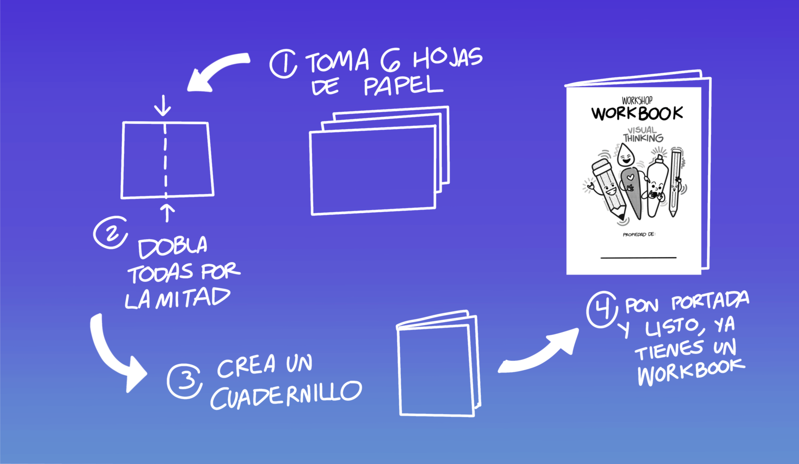
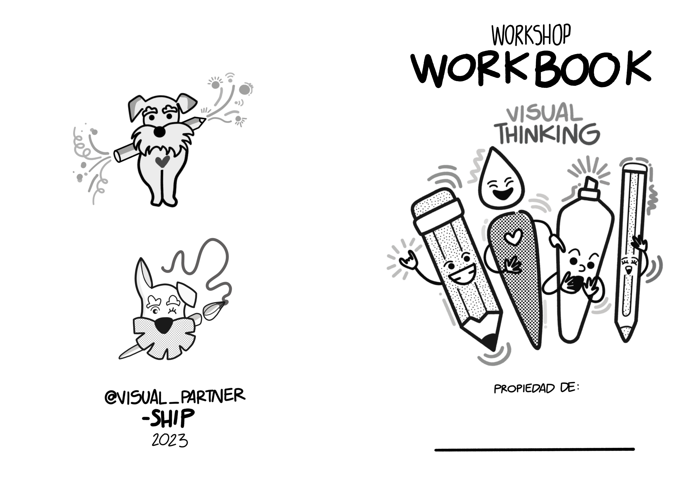
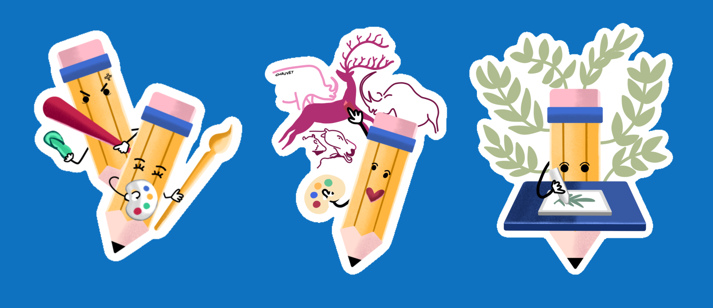

# Garabatos para ilustrar un reflejo: Visual Thinking 🎨

Bienvenidos a este workshop introductorio de Visual Thinking.

**Ilustraciones y actividades originales creadas por Carlo Gilmar para Visual Partner-Ship.**

## Materiales

1. Hojas blancas de papel
2. Plumas, plumones, o colores.

## Workbook

Se recomienda crear varios workbooks para hacer las actividades de este taller:

1. Toma 6 hojas tamaño carta.
2. Dobla todas por la mitad.
3. Crea un cuadernillo con ellas.
4. Pon una portada.
5. Úsalo como cuaderno, al terminar las 6 hojas, crea uno nuevo.
6. La idea es mantener los workbooks pequeños y muy concisos, y hacer todos los que necesites. Es una gran herramienta de aprendizaje.
7. Te dejo una portada que puedes imprimir para tus workbooks.

**Para este taller no se recomienda hacer uso de tabletas electrónicas.**

## Sobre el workshop 🎁

El **Pensamiento Visual o Visual Thinking** es una habilidad que nos permite construir representaciones visuales a partir de la percepción de nuestra realidad. A lo largo de años de práctica y aprendizaje he desarrollado este workshop para comprender **los principios básicos** del Visual Thinking de tal forma que puedas aprender a crear tus propias herramientas visuales.

Más de mostrarte los pasos para crear una ilustración, pretendo guiarte a través de actividades prácticas para que descubras tu habilidad de visua thinking. Este workshop fue diseñado para impartirse de manera presencial, sin embargo puedes tomarlo por tu cuenta, se recomienda hacerlo en compañía de amigos o familia para que puedan complementar sus resultados. ❤️

Este workshop se divide en tres partes:

1. Tu relación con el dibujo 🩴.
2. Interpretación Visual 🖍️.
3. Representaciones Visuales ❤️.

---

## Actividades ✌️

## Versión Extendida 🚀

Si completaste este taller y te interesa en seguir aprendiendo, aquí te dejo otras actividades.

## Feedback

## Gracias por realizar el workshop de Visual Thinking 😁

Si terminaste parte de este taller, te pido considerar:

1. Dale ⭐️ a este repositorio para saber que lo usaste.
2. Comparte tus ejercicios en twitter o instagram taggeando a `@visual_partner`.
3. Puedes dejar tu feedback en algún issue de este repo.
4. Si quieres compartir algún comentario o necesitas apoyo en las actividades puedes buscarme en las cuentas de Visual Partner-Ship.
5. Sigue las redes sociales para más workshops.

## Tooling and more resources

Cursos de dibujo:

- [Dibujo para princiantes](https://www.domestika.org/es/courses/138-dibujo-para-principiantes-nivel-1)
- [Metodología de trabajo en libretas de dibujo](https://www.domestika.org/es/courses/1967-metodologia-de-trabajo-en-libretas-de-dibujo/course)

Cursos de Procreate para iPad:

- [Art with Flo](https://www.youtube.com/@ArtwithFlo)
- [Procreate técnicas de ilustración creativa](https://www.domestika.org/es/courses/946-procreate-tecnicas-de-ilustracion-creativa/course)
- [Composición creativa para ilustración en Procreate](https://www.domestika.org/es/courses/1509-composicion-creativa-para-ilustracion-con-procreate/course)
- [Diseño e ilustración digital de tatuajes en Procreate](https://www.domestika.org/es/courses/468-diseno-e-ilustracion-digital-de-tatuajes-con-procreate/course)

Recursos de Visual Thinking y referencias:

- [Visual Thinking Domestika](https://www.domestika.org/es/courses/3825-visual-thinking-organiza-y-presenta-ideas-potentes)
- [Pataleta](https://pataleta.net/aprendizaje/)
- [Visual Thinking: Empowering People & Organizations Through Visual Collaboration](https://www.amazon.com.mx/Visual-Thinking-Empowering-Organizations-Collaboration/dp/9063694539)
- [Visual Thinking Rudolf Arnheim](https://www.amazon.com.mx/Visual-Thinking-Rudolf-Arnheim/dp/0520242262/)
- General Theory Systems by Bertanlanffy
- Drawing a Hypothesis by Nikolaus Gansterer
- [Festival de Pensamiento Visual](https://instagram.com/imaginadibujacrea?igshid=NTc4MTIwNjQ2YQ==)

Contenido original por @carlogilmar. Octubre 2023.

