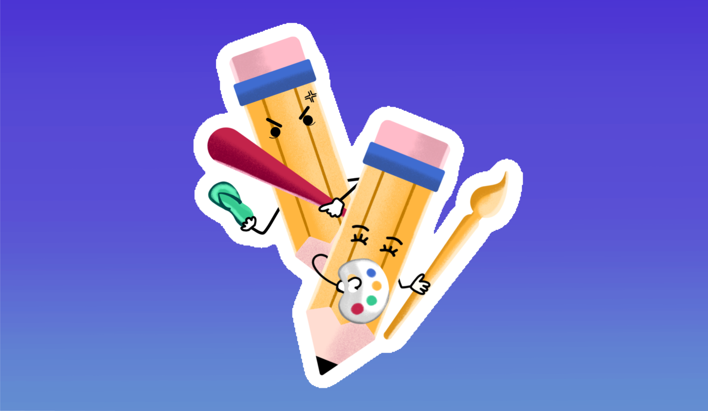
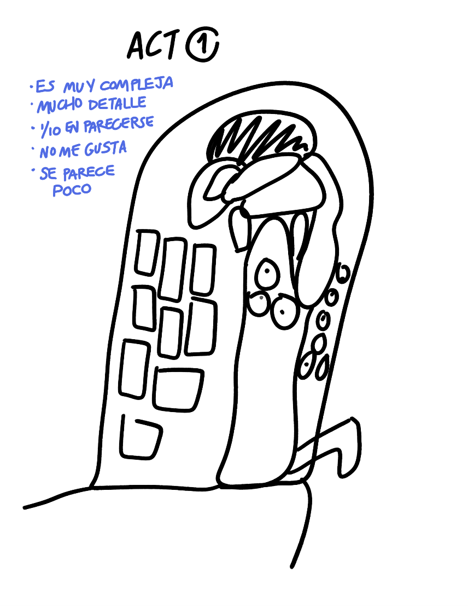
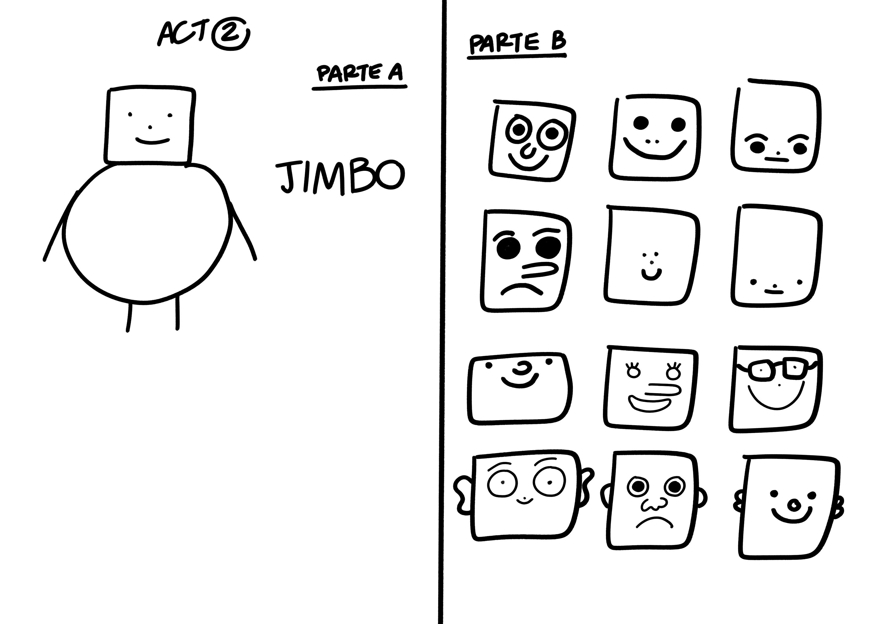
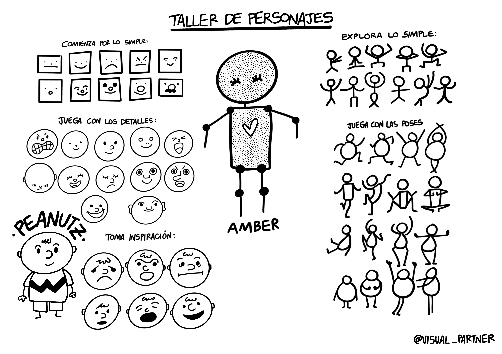
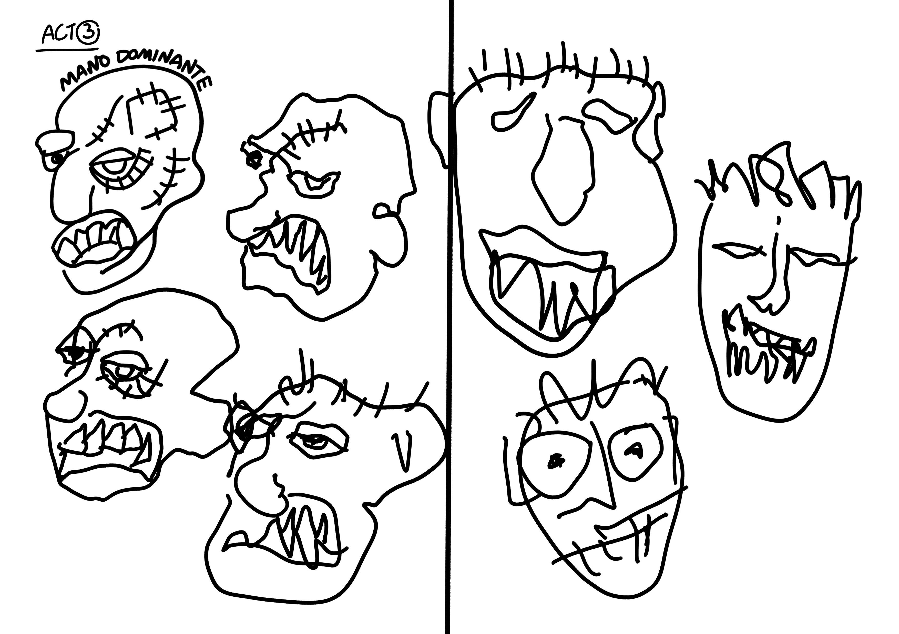
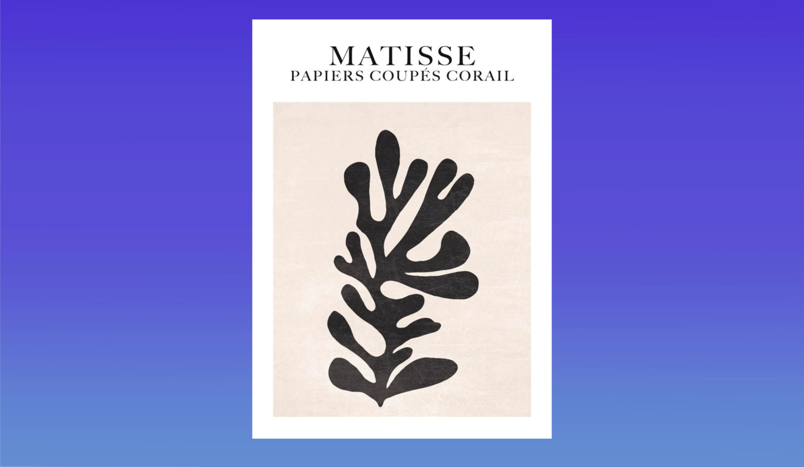
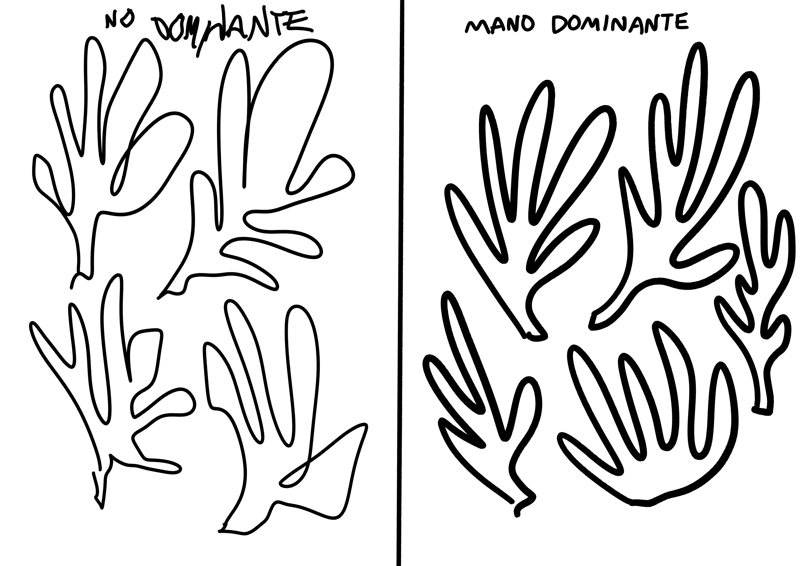
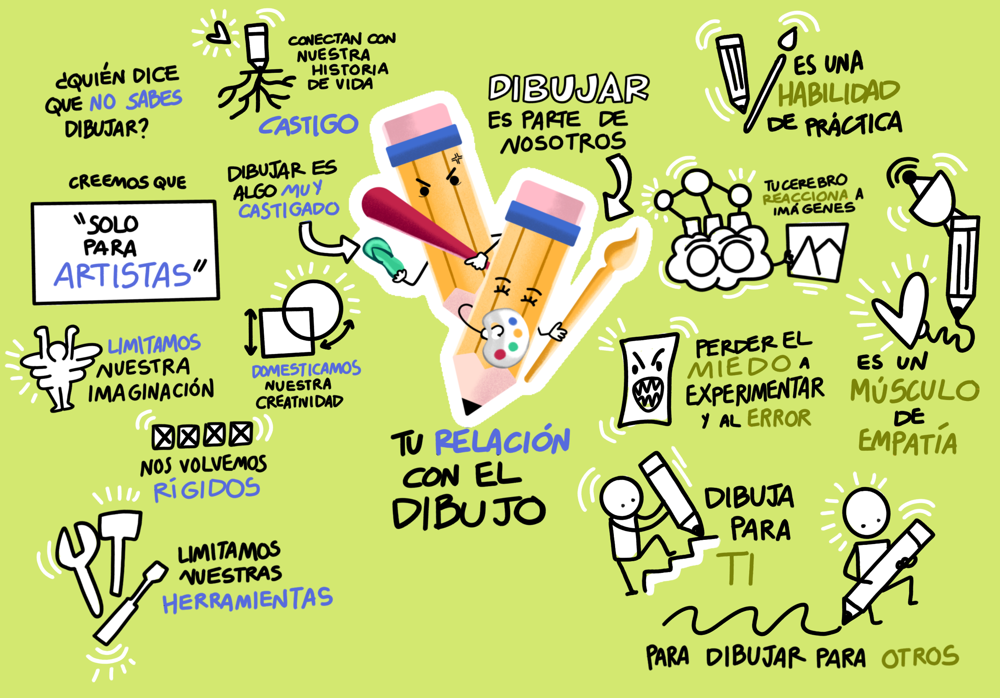

## Parte 1: Tu relación con el dibujo.

A menudo subestimamos nuestra relación con el arte y el dibujo, creemos que es algo sólo para grandes artistas. Esto es porque desde pequeños vivimos muy castigados y bajo la sombra de hacer las cosas "en regla", "bien" y "bonito" 🩴. Y a su vez esto provoca que crezca en nosotros una inseguridad respecto a nuestra habilidad del dibujo en nuestro día a día. Los juicios de valor sobre nosotros son aterradores y muy fuertes, de tal forma que abandonamos la posibilidad de usar nuestro trazo como una herramienta principal porque "no somos lo suficientement artísticos" para usarla.

Esta sección trata de trabajar con esta habilidad tan castigada, el gran objetivo es perderle el miedo al lápiz, y en vez de verlo como un castigo comenzar a verlo como una herramienta para experimentar y jugar libremente.

### Actividad 1: Mis frustraciones

1. Mira la pintura del Beso de Gustav Klimt.
2. En una hoja de papel, con un solo color de pluma/plumón trata de imitar los rasgos más importantes de la imagen.
3. Capta todos los detalles que puedas: círculos, rectángulos, figuras, extremidades, flores, etc. Es un cuadro complejo.
4. Limita esto a cinco minutos ¿lo lograste?.
5. Anota sobre tu ilustración cómo te has sentido con este ejercicio.

Este ejercicio trata de ejemplificar un caso muy cotidiano del dibujo: no saber dibujar. Conecta con esa frustración de la línea chueca, la dificultad para las dimensiones, el tiempo, el grosor, los símbolos que no te salieron, y anótalos ahí mismo.

### Actividad 2: Taller de personajes

**Parte A: Creación de personaje**
1. Elige una figura geométrica.
2. Agrega detalles: ojos, nariz, y boca. No importa el nivel de detalle, hazlo simple.
3. Elige una figura geométrica diferente y úsala para el cuerpo.
4. Agrega extremidades: manos y pies. ¡Listo, tienes un personaje!
5. Ponle un nombre.

**Parte B: Exploraciones de cara**
1. Llena una página con la figura de la cara que elegiste. No importa que tan geométrica te quede.
2. Llena cada figura explorando diferentes combinaciones, prueba hacer diferentes ojos, diferentes tamaños de nariz, diferente posición, incluye orejas, bigote, etc. Sé libre de presentar nuevos detalles, no importa si no te gusta. Sé libre de explorar.
3. Juega también con las emociones, presenta caras de amor, alegria, miedo, tristeza, asco, enojo, etc.

**Parte C: Exploraciones de cuerpo**
1. Llena la página de diferentes cuerpos de tu personaje, puedes variar los tamaños y las formas.
2. Agrega cara a todos los cuerpos, experimenta también con el tamaño y las expresiones como en el ejercicio anterior.
3. Agrega extremidades, juega con la posición de las manos y los pies.
4. Puedes agregar alguna otra ocurrencia. No intentes repetirlo, juega con las posibilidades y variaciones lo más que puedas.

**Parte D: Exploraciones de tu personaje**
1. De los ejercicios anteriores elige cuál personaje es tu favorito.
2. Toma ese personaje y replícalo, recuerda ponerle su nombre.
3. En toda la hoja repite ese personaje, haz pequeñas variaciones pero conservando la esencia de lo que ya elegiste.

Esta actividad se trata de iterar. A través de la iteración de hacer varios experimentos es posible ir soltando el trazo y sobre todo ir reconociendo la habilidad que tienes para dibujar, el propósito es experimentar con diferentes variaciones hasta encontrar la combinación que más te guste. Un truco muy importante es el de explorar un dibujo con repeticiones, con esto tu mano va adoptando comodidad sobre el mismo trazo y va encontrando formas diferentes de añadir nuevos detalles. Esta es una gran técnica para practicar tu dibujo. Reconecta con tu habilidad de dibujo.

### Actividad 3: Mano no dominante

**Parte A: Retrato a mano cambiada**
1. Mira de nuevo **El Beso**.
2. Realiza un retrato de nuevo, esta vez usa tu mano no dominante.
3. Capta la mayor cantidad de detalles posible usando tu mano no dominante.
4. Compara este retrato con el del primer ejercicio. ¿Se parecen?

**Parte B: Los personajes de Basquiat**

1. Mira atentamente algunos retratos de Basquiat.
2. Haz una serie de retratos con la mano no dominante tratando de captar la mayor cantidad de detalles.
3. Con la mano dominante haz repeticiones de tus retratos, deja que tu mano te guíe.

**Parte C: Las recortes de Matisse**

1. Mira atentamente la pintura de Matisse.
2. Divide una hoja en dos secciones. En una realiza repeticiones de lo que vez con tu mano dominante, en la otra sección con tu mano dominante.
3. En otra hoja realiza nuevamente retratos de la pintura a dos manos.
4. Siéntete libre de explorar y que sean tus manos las que guíen tu pulso. Se trata de explorar.

Muchas veces estamos con la idea de la perfección en dibujo, esto provoca que inconsientemente intentémos replicar el dibujo bajo ciertas premisas. Sin embargo el dibujo es una habilidad muy flexible, que puede ser muy improvisada y a la vez funcional. Dibujar con la mano no dominante es una actividad incómoda porque pierdes el control de lo que dibujas. Como lo muestra el arte de Basquiat, a veces es también un canal para desarrollar nuevas formas de comunicarte.

Estas actividades son para conectar con la frustración y el rechazo del dibujo que todos llegamos a tener en cierta medida, con el taller de personajes aprendiste una gran forma de practicar el dibujo sobre iteraciones y exploraciones, mientras que con el dibujo con ambas manos te pone en una situación donde no puedes controlar del todo la línea de tu trazo y es tu única herramienta para dibujar. Conscientiza tu habilidad para dibujar y el potencial que puedes tener con la práctica. Te invito a repetir estos ejercicios las veces que sean.

 👈
