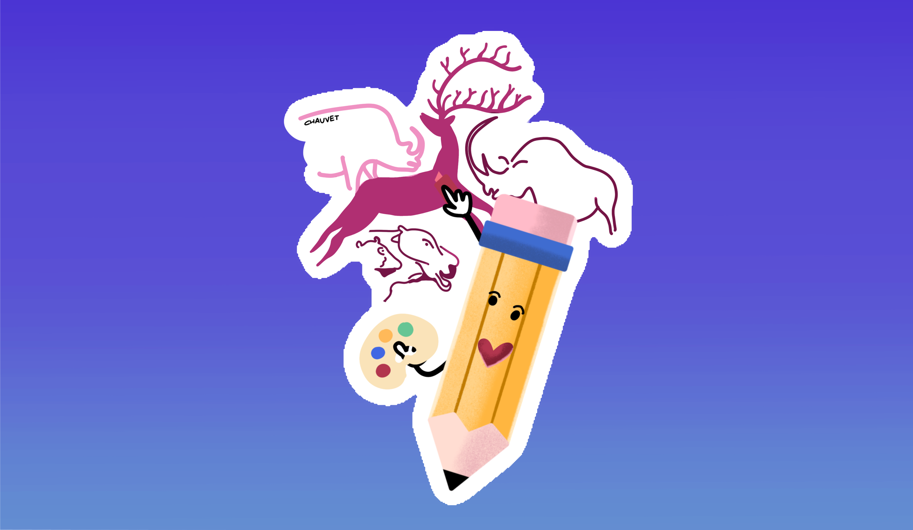
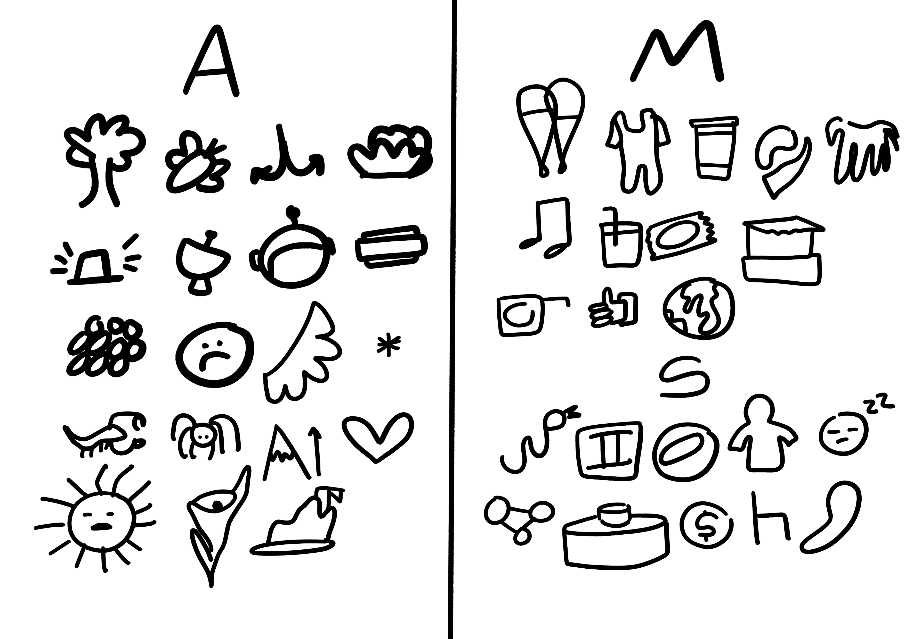
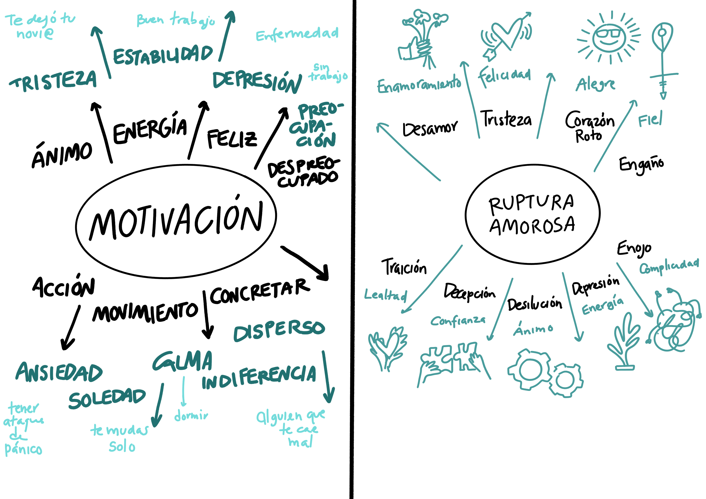
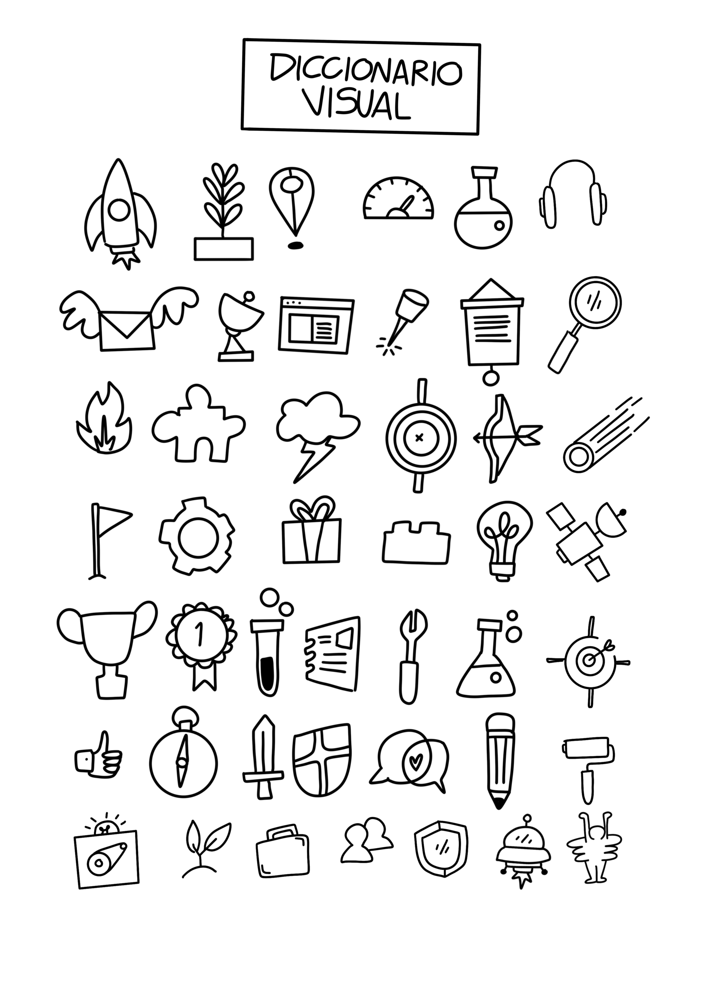
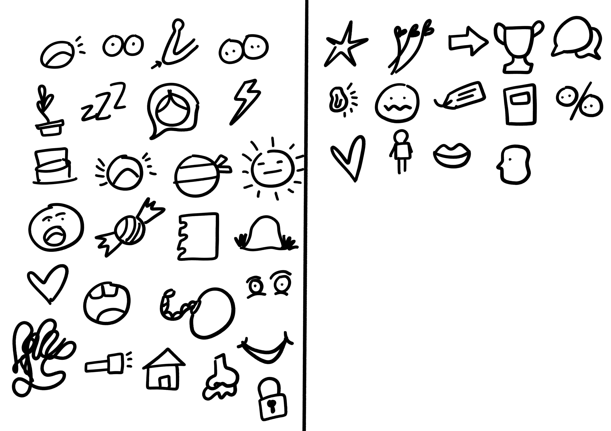

## Parte 2: Interpretación Visual

### Actividad 4: Basta Visual

1. Elige una letra del abecedario. Anota todas las palabras que puedas en un minuto.
2. Ahora en tres minutos dibuja un ícono simbólico de las palabras que escribiste.
3. Si terminas de dibujar todos, vuelve a dibujar las palabras con un ícono diferente, haz variaciones.
4. Trata de ser rápido y contundente con tus íconos, se trata aquí de dibujar la mayor cantidad de dibujos, no importa la calidad de ellos, pueden ser garabatos o dibujos muy sencillos.

En este ejercicio es importante la velocidad, practicando esto puedes comenzar a desarrollar las habilidades inmediatas de asociación palabra con imagen. Este es un proceso mental que necesita mucha práctica. Somos receptores de información, al traducirla en un ícono visual, estás procesando al momento dicha información.

### Actividad 5: Semánticas visuales

1. Elige un tema al azar: `Motivación`, `Depresión`, `Felicidad`, `Arte`, `Profesión`.
2. Anota el tema al centro de tu hoja, ahora a continuación comienza a anotar alrededor todas las ideas relacionadas al tema. Todas las que puedas
3. Ahora alrededor de estas ideas anota los antónimos de las ideas que anotaste.
4. Cuando termines, anota ahora un ejemplo concreto de la idea más cercana que anotaste. Ejemplo: `Despreocupado` -> Antónimo: `Preocupad` -> Ejemplo: `Quedarse sin trabajo.`
5. En otra hoja anota el tema elegido al centro.
6. Realiza el mismo ejercicio, anota las ideas cercanas a la idea central, luego los antónimos, solo que después de estos, en vez de anotar algo, ilustra tus ejemplos concretos.

La asociación de ideas es algo que nos ayuda a enriquecer un contexto dado, asociar ideas afínes nos permite extender la comprensión de algo, y sobre todo nos permite dotarlo de significado. Hacer esto de forma visual es un gran paso en nuestra percepción del pensamiento visual. Te aconsejo ir creando un diccionario visual donde anotes los íconos que vas encontrando en tu camino, de tal forma que los tengas a la mano para disponer de ellos. De momento te dejo un diccionario visual con algunos iconos que puedes usar e ir complementando.

### Actividad 6: Traducción Visual

1. Escucha el siguiente audio: [Mirarte a los ojos de Nacho Aldeguer](https://www.youtube.com/watch?v=kERo9cjL-rU&t)
2. Al centro de tu hoja escribe como título "Mirarte a los ojos".
3. Mientras escuchas ve dibujando las ideas que escuches. Trata de anotar la mayor cantidad posible.
4. Repite el audio una segunda vez para repetir el ejercicio y complementar tu ilustración.

Muchas veces es imposible tener la velocidad para dibujar exactamente todo lo que escuchas, tal es el caso de una canción, una charla, una conferencia, una clase. Sin embargo no siempre tienes que procesar todo, es más, no tienes que preocuparte tanto de qué procesas, sino de ser consciente de qué es lo que procesas. Tal vez en un audio de pocos minutos solo logres hacer 3 o 4 íconos, pero es la suma de esos elementos lo que representa lo que más conectas de inmediato.

### Actividad 7: StarMachine

1.  Encuentra un símbolo para los siguientes instrumentos musicales: star machine, máquina de escribir, marimba, bateria, melódica, y teclado. Pueden ser las iniciales, íconos, figuras, etc.
2. Toma una hoja de papel completa y dos plumones de diferente color.
3. Escucharas la canción en vivo de Starmachine 2000 https://www.youtube.com/watch?v=mf3bhAayHaw, al momento de iniciar, con la mano no dominante irás colocando puntos pequeños conforme va corriendo la música, deja que tu mano te guíe y que la presión de los puntos sea sensitiva al ritmo de la música.
4. Mientras la música y el video van corriendo, con tu mano dominante irás anotando la inicial del instrumento que vaya apareciendo en el video.
5. El objetivo es dibujar el flujo de ritmo que vas escuchando con tu mano no dominante, y al mismo tiempo ir anotando las veces que ves un instrumento musical.
6. Cuenta y agrupa el número de veces que viste cada instrumento.
7. En otra página visualiza dos datos, por un lado la pulsión de tu mano no dominante en la música, por otro el número de veces que captaste un instrumento.

 👈
