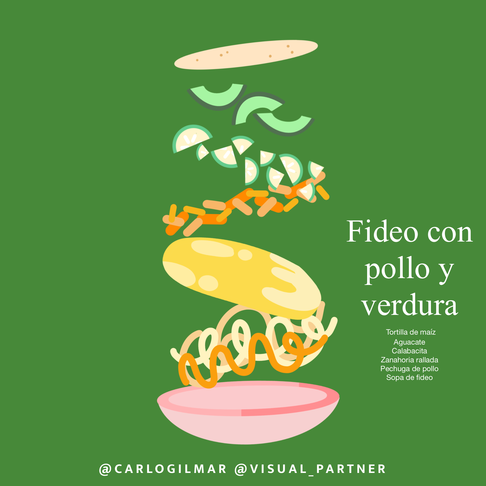
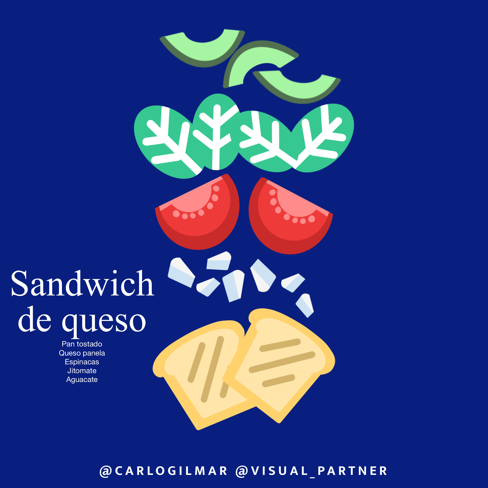
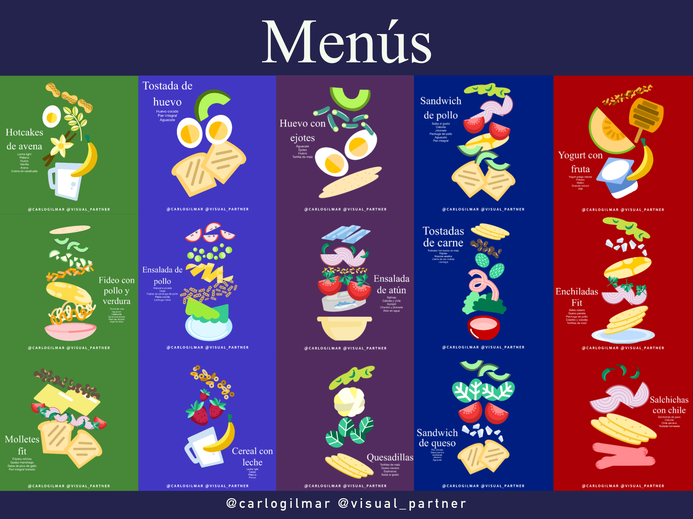
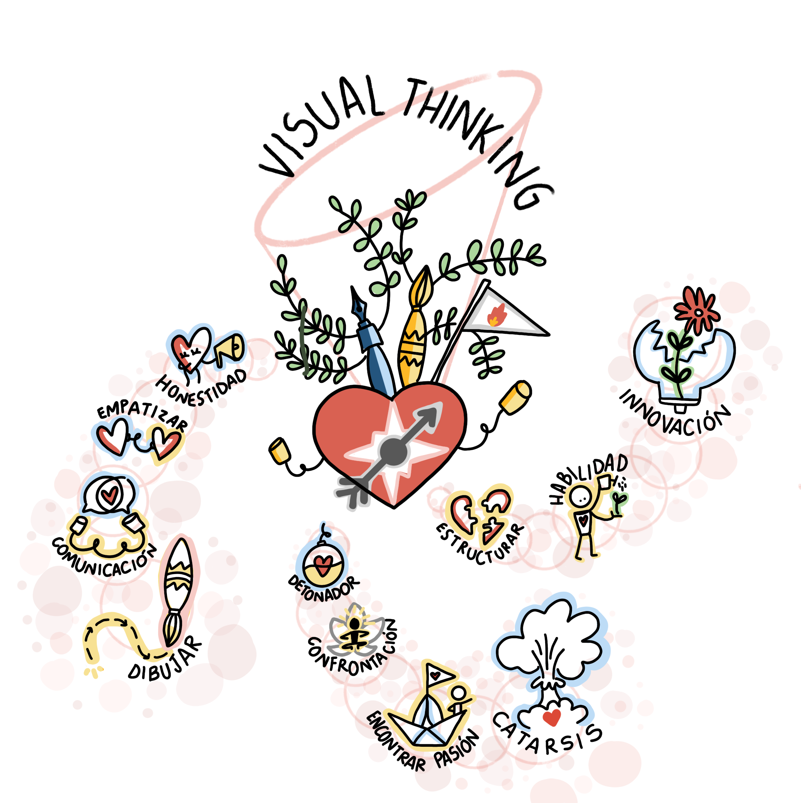
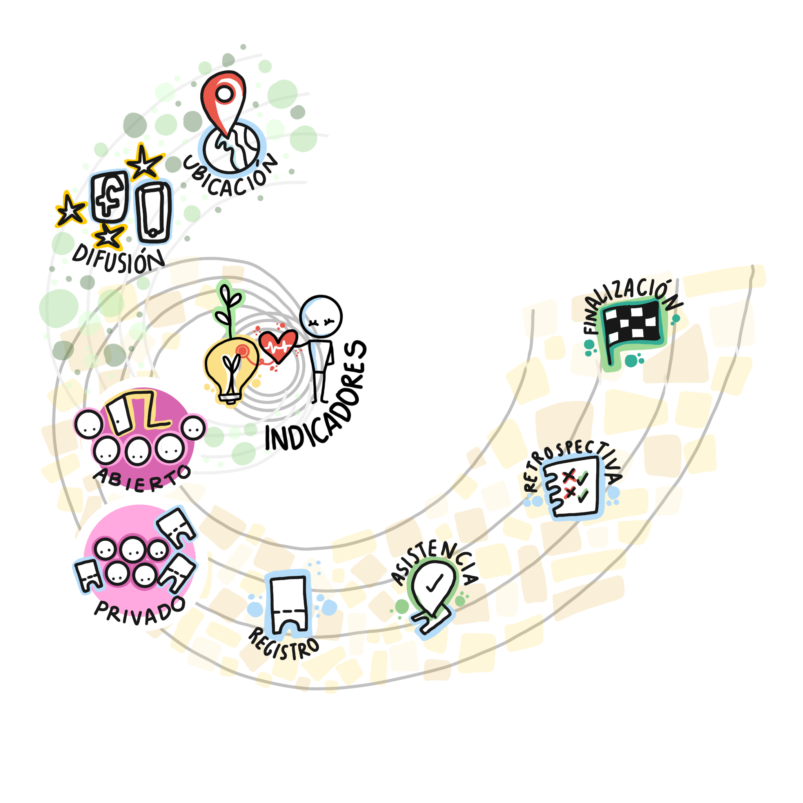
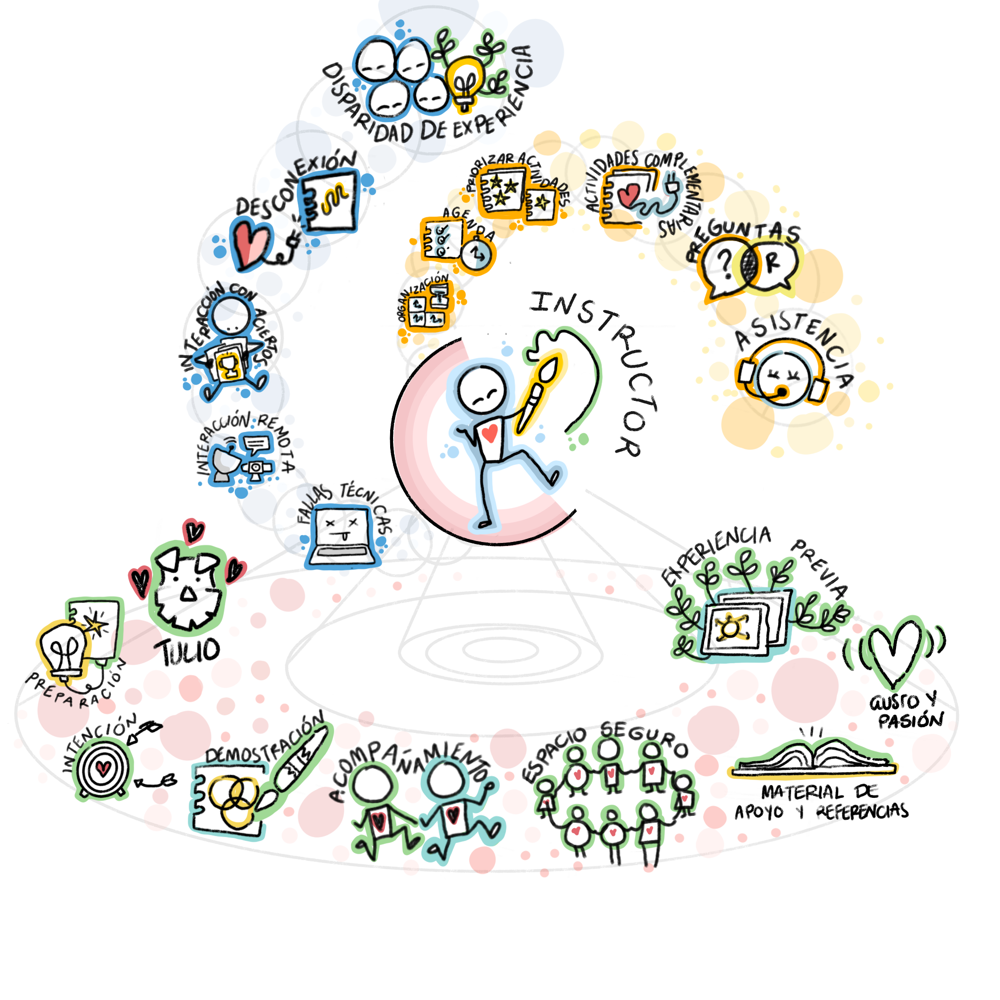
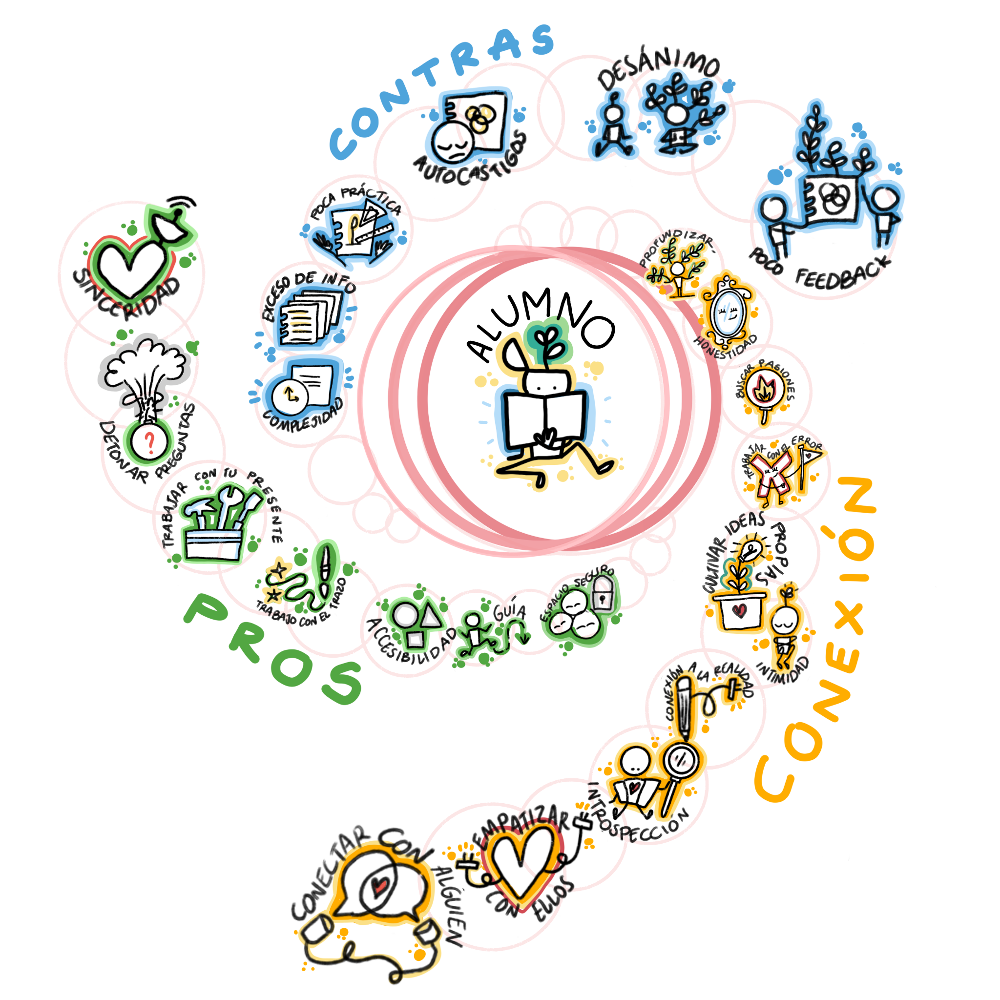
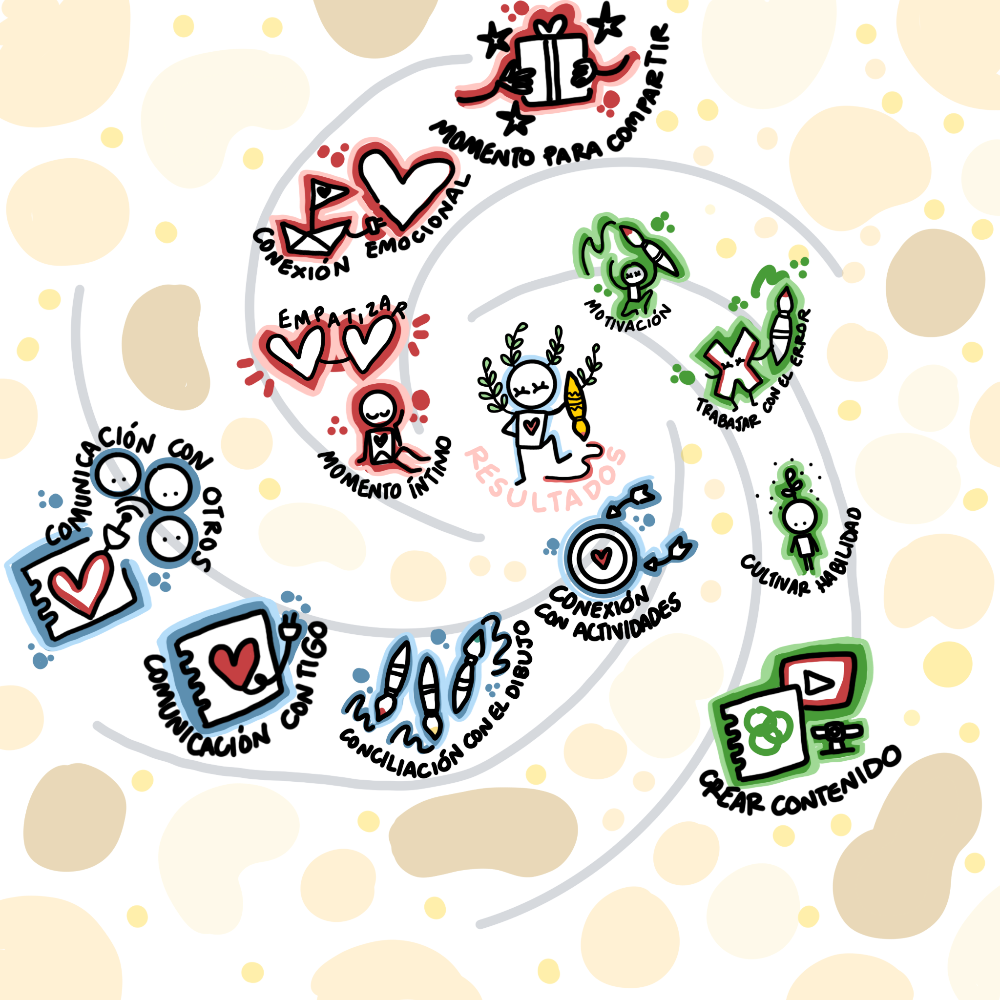
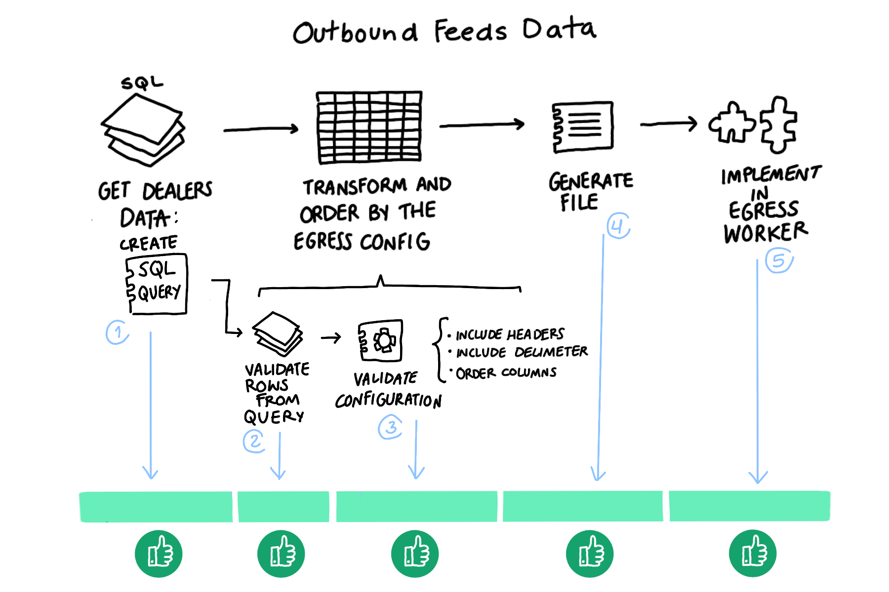
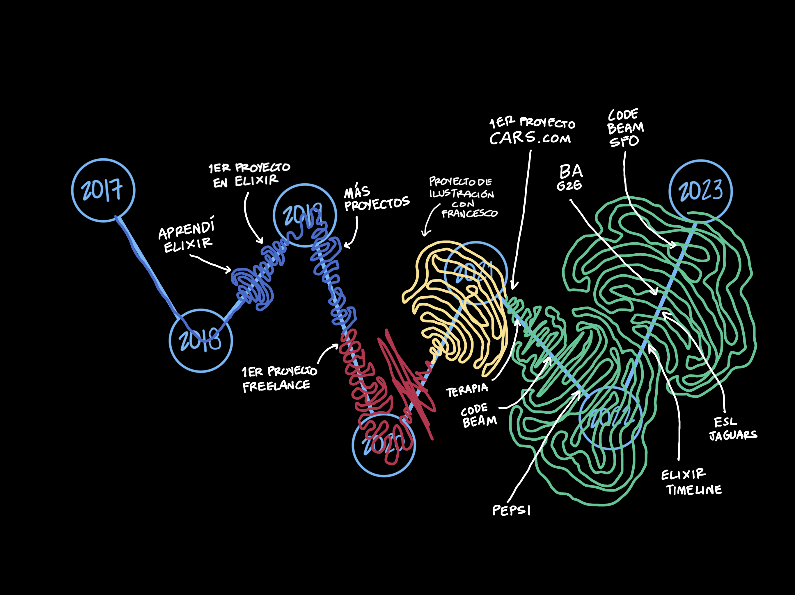

# Final del taller

## Visual Thinking para procesos personales

## Visual Thinking para retrospectivas semánticas

## Visual Thinking para comunicación efectiva

## Visual Thinking para biografías visuales

## Visual Thinking

